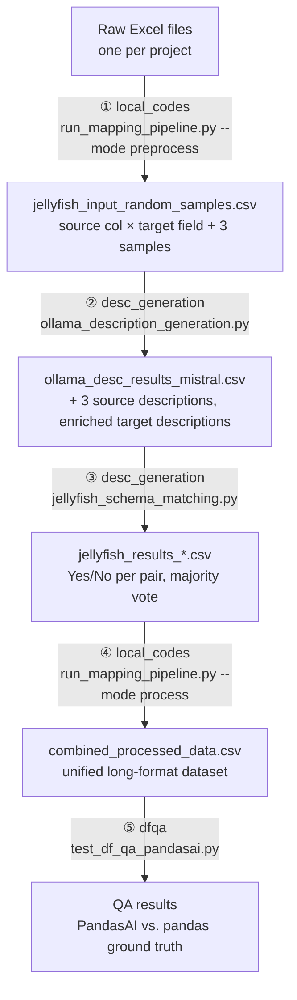

# Integrating Heterogeneous Environmental Permitting Spreadsheets through LLM-Assisted Schema Matching and Deterministic Normalization

Code for my MSc thesis in Computer Science at the University of British Columbia (2026), supervised by Prof. Laks V.S. Lakshmanan.

📄 **Thesis:** [`thesis/ubc_2026_may_dehghani_dorna.pdf`](thesis/ubc_2026_may_dehghani_dorna.pdf)

---

## Overview

Environmental assessment and mine-permitting reviews produce many project-specific Excel spreadsheets. Each one records rounds of **comments** from reviewing agencies and **responses** from the project proponent. The spreadsheets hold similar information (comment text, response text, dates, agency, status, review round…), but their **column names, layouts and value formats differ from project to project**. Some store each review round as its own row (*long* format). Others repeat column groups for each round in a single row (*wide* format).

This repository contains a modular pipeline that turns these heterogeneous spreadsheets into **one unified, long-format dataset**. In the output, every row is a single comment–response pair:

1. **Structural cleaning:** finds the right sheet and header row in each Excel file.
2. **LLM-generated column descriptions:** a local LLM (Mistral via Ollama) describes each source column from its name and sample values. Target schema fields get enriched descriptions the same way.
3. **LLM schema matching:** [Jellyfish](https://huggingface.co/NECOUDBFM) (7B/8B) decides, for each source↔target pair, whether the two columns mean the same thing (Yes/No). An optional embedding pre-filter narrows the candidate pairs, and a majority vote is taken over 3 description variants.
4. **Deterministic value normalization:** rule-based transforms for dates, agency names, compound IDs, status, comment types, null placeholders and review rounds. This step also converts wide format to long format.
5. **Downstream question answering:** PandasAI with a local code LLM answers analytical questions over the normalized table. Its answers are checked against pandas ground truth.

All LLMs run **locally** (Ollama / Hugging Face on a single GPU). No external LLM APIs were used.

> ⚠️ **Data notice.** The spreadsheets used in this thesis are non-public administrative permitting records shared for research purposes only, so **no data is included in this repository**. Server paths, e-mail addresses, personal names, project names and real record identifiers in the code have been replaced with placeholders (e.g. `/path/to/...`, `<YOUR_EMAIL>`, `Jane Doe`, `ABC-123-R1`). The CSVs in [`examples/`](examples/) are **synthetic** and only show the file formats.
>
> The code is shared close to how it was used for the thesis. It is **not yet set up to run out of the box**: paths are placeholders, and a few helper imports and file renames between steps were handled by hand (see [Known gaps](#known-gaps)).

---

## Repository structure

```
.
├── local_codes/                  # Run locally (laptop): steps 1 and 4
│   ├── run_mapping_pipeline.py   # CLI entry point (modes: preprocess / process / full)
│   ├── mapping.py                # Pipeline classes: Excel preprocessing, structure detection,
│   │                             #   jellyfish-result parsing, wide→long, value transforms
│   ├── config.py                 # Heuristic thresholds, keyword lists, normalization dictionaries
│   └── visualizations.py         # Exploratory plots on the merged/normalized dataset
│
├── desc_generation/              # Run on a GPU server (SLURM): steps 2 and 3
│   ├── ollama_description_generation.py   # Step 2: column descriptions with Mistral (Ollama)
│   ├── run_ollama_desc_generation.sh      #   SLURM launcher for step 2
│   ├── jellyfish_schema_matching.py       # Step 3: Jellyfish Yes/No matching + voting
│   ├── run_jellyfish_schema_matching.sh   #   SLURM launcher for step 3
│   ├── ollama_prompts.txt                 # Prompt variants tried for description generation
│   └── jellyfish_prompts.txt              # Prompt variants tried for schema matching
│
├── dfqa/                         # Run on a GPU server (SLURM): step 5
│   ├── test_df_qa_pandasai.py    # PandasAI QA over the normalized CSV + ground-truth check
│   └── run_test_df_qa_pandasai.sh
│
├── examples/                     # Synthetic sample files showing intermediate formats
├── thesis/                       # Thesis PDF
└── requirements.txt
```

---

## Pipeline



| Step | Where | Script | Input → Output |
|---|---|---|---|
| ① Preprocess | local | `local_codes/run_mapping_pipeline.py --mode preprocess` | `*.xlsx` → `jellyfish_input_random_samples.csv` |
| ② Description generation | server | `desc_generation/run_ollama_desc_generation.sh` | pair CSV → `ollama_desc_results_mistral.csv` |
| ③ Schema matching | server | `desc_generation/run_jellyfish_schema_matching.sh` | descriptions CSV → `jellyfish_results_<config>.csv` |
| ④ Value matching / normalization | local | `local_codes/run_mapping_pipeline.py --mode process` | `*.xlsx` + jellyfish results → `combined_processed_data.csv` |
| ⑤ Question answering | server | `dfqa/run_test_df_qa_pandasai.sh` | normalized CSV → `test_results_*.csv`, `test_log_*.txt` |

Steps ①–④ were run separately on the training and test project splits (`data/` and `data_new/`), so the pipeline could be evaluated on spreadsheet layouts it had not seen before.

### ① Preprocessing: Excel → Jellyfish input (`local_codes/`)

`ExcelPreprocessor` in `mapping.py`:

- **Sheet selection:** skips sheets whose names contain `summary`, `metadata`, `legend`, `cover` or `readme`. It prefers sheets named like `comment`, `data`, `main`, `table` or `itt`. If several sheets qualify, it picks the one with the most rows.
- **Header detection:** scans the first 20 rows. A row is a candidate header if it has at least 3 header-keyword hits and at least 5 non-empty cells. Rows with long cell text get a length penalty, because long text usually means a data row.
- **Cleaning:** converts placeholder values (`-`, `x`, `~`, `nan`, blanks…) to NaN, drops empty rows and columns, and de-duplicates column names.

`ColumnMapper.create_jellyfish_input` then forms the **cross product of every source column with every target schema field**. It attaches 3 random unique sample values per source column (`random_state=42`) and the source filename. Pairs are de-duplicated within a file, not across files, because the same header can hold different values in different projects.

**Target schema** (`get_target_schema()` in `mapping.py`):

| Field | Meaning |
|---|---|
| `comment_id` | Unique identifier for the comment |
| `section` | Document section being referenced |
| `topic` | Topic or theme of the comment |
| `round` | Review round number |
| `comment_type` | Type of comment (e.g. Information Requirement) |
| `comment_text` | Full text of the comment |
| `response_text` | Proponent's response to the comment |
| `author` | Author of the comment |
| `date_received` | Date comment was received |
| `date_responded` | Date response was sent |
| `status` | Current status of the comment |
| `agency` | Reviewing agency |
| `project` | Project name (taken from the filename) |

### ② Column description generation (`desc_generation/ollama_description_generation.py`)

- Starts an Ollama server on the compute node and calls `/api/generate` with **Mistral 7B** (`temperature=0.1`, one sentence, at most about 25 words, starting with "This column…").
- **Source columns:** generates `N` (default 3) description variants for each unique *(column name, sample values)* combination. They are stored as `source_description_1..3`.
- **Target fields:** the hand-written schema description is expanded once by the LLM and cached in `generated_target_descriptions.json`.
- The prompt includes the domain context: a back-and-forth comment table between reviewers and a proponent for a major mine project. `ollama_prompts.txt` keeps the other prompt variants that were tried.

### ③ Schema matching with Jellyfish (`desc_generation/jellyfish_schema_matching.py`)

- **Optional embedding pre-filter:** `all-MiniLM-L6-v2` embeds `"name + description"` for sources and targets. For each source it keeps the top-k targets (default `k=5`) with cosine similarity of at least 0.25, using the maximum over the 3 source descriptions.
- **De-duplication:** each unique *(source, target)* pair is scored once, and the result is copied back to all duplicate rows.
- **Jellyfish-7B / 8B** (`NECOUDBFM/Jellyfish-*`, fp16, greedy decoding) answers whether *Attribute A* and *Attribute B* are semantically equivalent. Chain-of-thought and source sample values can each be switched on or off.
- The model runs **once per source description (3 runs)**, and the final label is a **majority vote** (ties go Yes > No > Unknown).
- Outputs: the full results CSV, a `*_yes_only.csv`, and `*_voting_stats.csv` with agreement levels.

All options are set as environment variables in `run_jellyfish_schema_matching.sh` (`MODEL_ID`, `USE_COT`, `INCLUDE_SAMPLES`, `USE_FILTERING`, `FILTER_TOP_K`, `FILTER_THRESHOLD`, `TEST_MODE`, …).

### ④ Rule-based value matching / normalization (`local_codes/`)

`run_mapping_pipeline.py --mode process` loads the Jellyfish results and runs `DataMappingPipeline.process_single_file` on each Excel file:

1. **Parse matches** (`ColumnMapper.parse_jellyfish_results`): keeps only `Yes` pairs. If one source column matches several targets, it picks the target whose name is most similar as a string (`SequenceMatcher`). For `comment_id`, `agency` and `author` it keeps only the first matching column per file.
2. **Make sure an ID exists:** if no column maps to `comment_id`, it adds a sequential ID.
3. **Detect structure** (`DataStructureDetector`): more than one `comment_text` **and** more than one `response_text` column means **wide** format. Otherwise the file is treated as **long**. In wide files, repeated column groups are numbered as rounds by their position.
4. **Reshape to long format** (`DataStructureTransformer`):
   - *Wide:* produces one output row per (record, round), using round-specific metadata where present and falling back to the first occurrence.
   - *Long:* rounds come from round tokens embedded in IDs (`…-R1`, `_Round 2`), or else from sequential numbering within the same `comment_id`. If several columns map to `comment_text` or `response_text`, the longest non-empty value is kept.
5. **Transform values** (`ValueTransformer`, with dictionaries in `config.py`):
   - `agency`: maps full names to abbreviations, matches known abbreviations, or builds an acronym. If there is no agency column, the agency is taken from compound IDs (`AGY-001` → `AGY`) or from the author field.
   - `date_*`: converted to `YYYY-MM-DD`.
   - `status` → Open / In Progress / Closed. `comment_type` → a standard set of types.
   - `round`: the number is extracted from text such as "Round 2" or "R2".
   - `author`: whitespace and titles are cleaned up.
6. Adds `source_file`, `project` and `data_structure`, fills in any missing schema columns, writes one CSV per file, then writes `combined_processed_data.csv` and `processing_summary.txt`.

`visualizations.py` makes exploratory plots from the merged dataset: response time by round, response-time ECDFs by agency, and cumulative comments by agency.

### ⑤ Downstream QA (`dfqa/test_df_qa_pandasai.py`)

- Wraps a local Ollama code model (`deepseek-coder:6.7b` or `qwen2.5-coder:7b`) as a PandasAI `LLM` and builds an `Agent` over the normalized CSV.
- Asks 15 questions in easy, medium and hard tiers: counts per round, the most common agency, median and 90th-percentile response times, unanswered rates, per-project and per-agency comparisons, and so on.
- Computes the **ground-truth answer with pandas** for each question and compares it to the model's answer. Numbers match within a tolerance; text answers match exactly or as a substring.
- Saves per-question results, accuracy and timing.

---

## Setup (reference only)

```bash
pip install -r requirements.txt
# Server steps also need: Ollama (https://ollama.com) with `mistral` and a code model pulled,
# and a GPU large enough for Jellyfish-7B/8B in fp16.
```

Before running anything, replace the placeholders in the `.sh` files: `<YOUR_EMAIL>`, `<YOUR_PARTITION>`, `/path/to/desc_generation`, `/path/to/dfqa`, `/path/to/scratch` and the `run_<TIMESTAMP>_…` input paths.

Example local commands:

```bash
cd local_codes
# ① build Jellyfish input from a folder of .xlsx files
python run_mapping_pipeline.py --mode preprocess --data-dir data --output-dir outputs/mapping

# ④ normalize using Jellyfish results from the server
python run_mapping_pipeline.py --mode process --data-dir data --output-dir outputs/mapping \
    --jellyfish-results path/to/jellyfish_results_7B_CoT_withSamples_filtered_top5_th0.25.csv
```

## Known gaps

The code is shared close to how it was run for the thesis. Known issues:

- `run_mapping_pipeline.py` imports `jellyfish_interface`, which is not included. It is not used by any of the modes, so the import can be removed.
- `ollama_description_generation.py` uses `datetime` without importing it (only hit when `RUN_DIR` is unset).
- Files were moved between the laptop and the server by hand. Step ①'s output (`jellyfish_input_random_samples.csv`) was renamed to `source_target_with_random_samples_columns.csv` (train) or `testdata_source_target_with_random_samples_columns.csv` (test) before step ②. Step ④'s output was copied to the server for step ⑤.
- Some heuristics are marked `#TODO` in the code for later review.

## Citation

```bibtex
@mastersthesis{dehghani2026integrating,
  author = {Dehghani, Dorna},
  title  = {Integrating Heterogeneous Environmental Permitting Spreadsheets through
            LLM-Assisted Schema Matching and Deterministic Normalization},
  school = {The University of British Columbia},
  year   = {2026},
  type   = {{M.Sc.} thesis}
}
```
